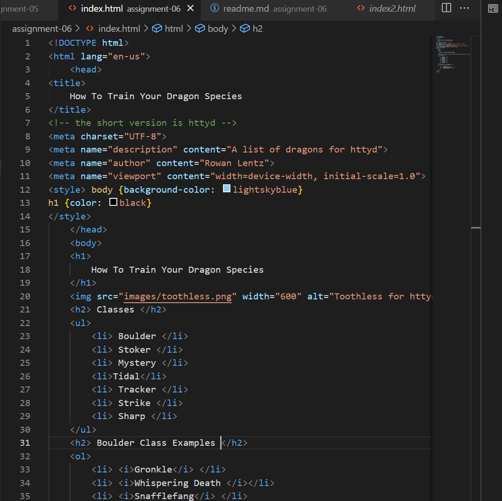

Structural markup embeds information about the document. It includes things like headings. It helps the user understand and navigate. Semantic markup reinforces information in a document using stylized text like italics.

