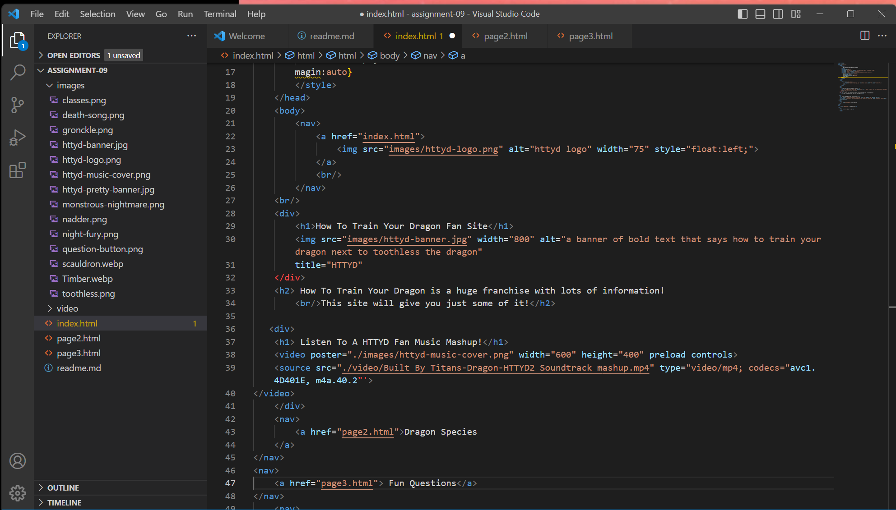

I acutally really liked HTML coding. It is just the right amount of difficult to do that it was kind of fun. I did have a hard time remembering some things so I did go back to look at my past assignments often.

I am anxious about learning CSS. I don't really know what that is or if it's related to HTML. But I'm looking forward to expanding on how my sites look.

