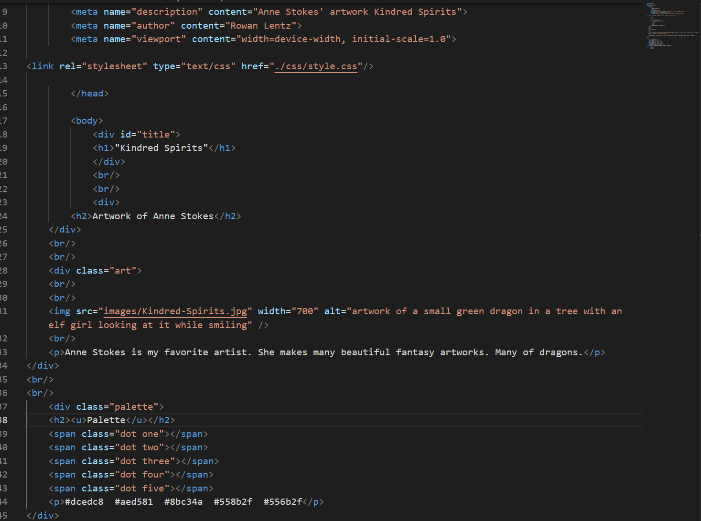

Universal selector stylizes everything in the html, this could be used to create a constant theme on a website. Element is used to style specific types of things, and could be used to color things like text. The Class selector is used to style things in a group which could be a quick way to create a sub-theme on your website or just organize something; and the ID selector is used once to style one thing, so it could be used to make something stick out more on your website.

I really like the tutorial's idea of making a website showcasing an art piece and making a color palette around that. The picture I chose is mostly green. So my color palette is just different shades of subtle greens, and I really like how it turned out.