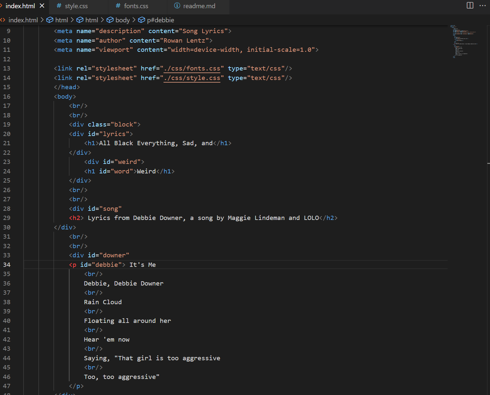

Typography is the art/science of arranging letters and text in a style appealing to the viewer. It includes spacing of letters, scentences, and paragraphs. As well as font type and color. Creators can use it in different ways depending on the emotion they want to provoke from the viewer, or convey different styles for a theme.

Fallback fonts are important for if a user's computer doesn't recognize a certain font and needs to display a different one. The creator can choose the alternitive fonts they want but need to keep in mind how these fonts would load.

System fonts are fonts that are already contained in your computer or device. They are usable in most programs but aren't guaranteed to be usable on the web. Web fonts are hosted on a server and need to be called from that server to appear, but require different elements to show up. Web safe fonts are families of fonts that are available in windows and mac. They are more reliable because any computer will have access to that font.