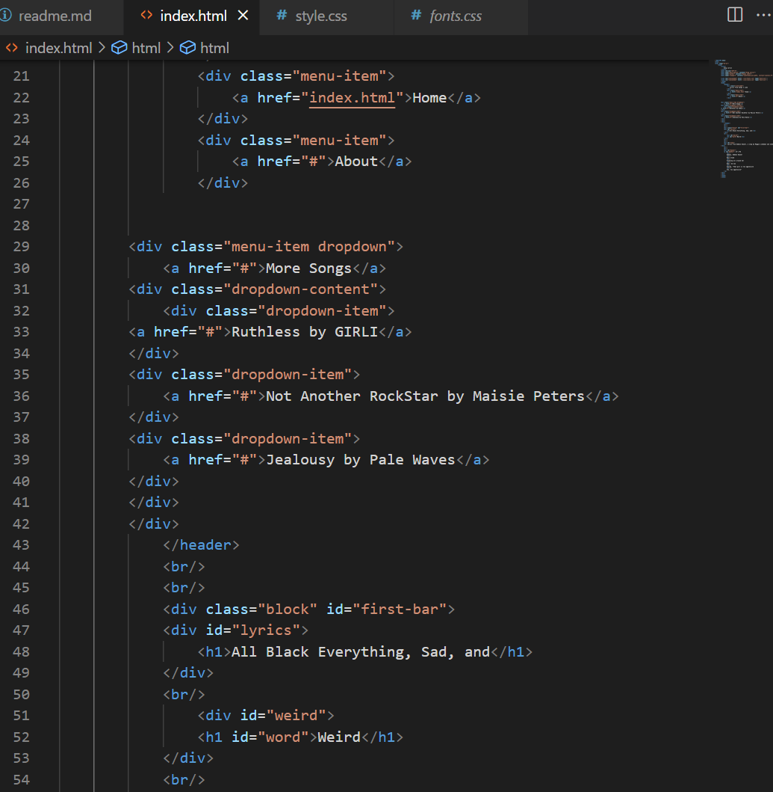

A border is used to style a website by surrounding something and changing the width, style, and color of the border to achieve a certain look.

Padding is the space between an inner content and the main content of a website.

Margin is a space. It can seperate a box or content and other things. Or it can be the edge of content that can be changed.